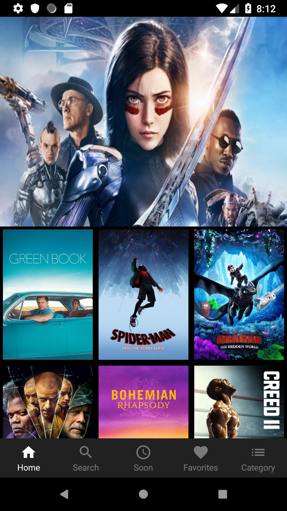
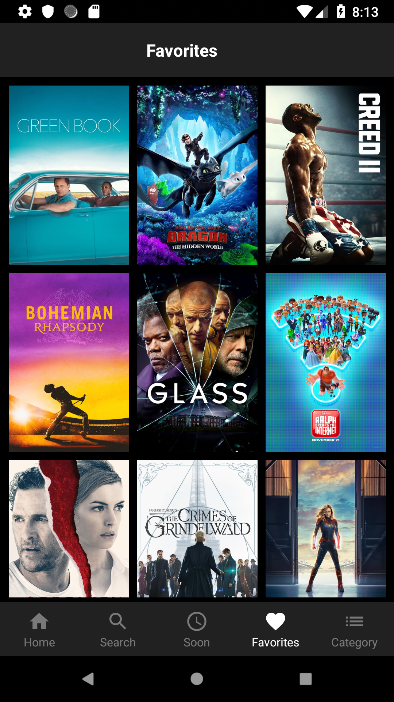
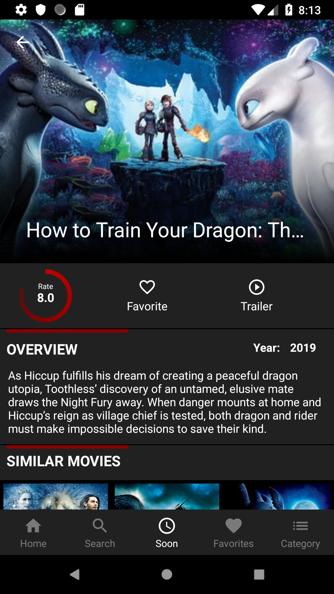

WikiMovies
===========

WikiMovies is an application for the purpose of finding and cataloging the movies, as well as the ones that are yet to come.
It is also possible to keep track of them by favoring them, just as you can view any movie trailer  by just pressing a button.

## App

   

## Tech Used

- Kotlin

- MVP Pattern

- Retrofit

- Constraint Layout

- Gson: Used to parse the requisition data.

- Picasso: Load the movies images.

## Author

Lucas Onofre, lucas-onofre@hotmail.com

## License

WikiMovies is available under the MIT license. See the LICENSE file for more info.
